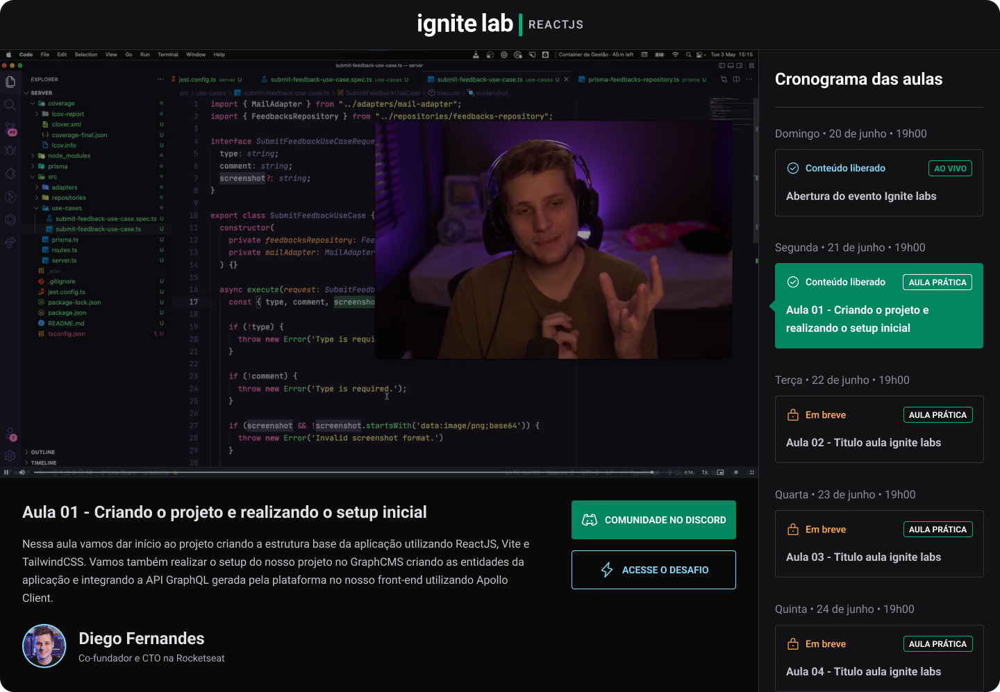

# Plataforma de Eventos



## Sobre

O projeto Plataforma de Eventos é uma plataforma para ajudar você a publicar e gerenciar seus eventos, agregando aulas com vídeos, data de publicação, assinatura, etc.

## Instalação

```bash title="Clone o repositório"
git clone https://github.com/manoguii/event-platform.git
```

- Para rodar o projeto localmente
  1. Primeiro você precisa criar uma conta nas plataformas na qual o projeto tem integração, o projeto usa o [Hygraph](https://hygraph.com/) para servir o conteúdo
  2. Crie um arquivo ```.env.local``` na raiz do projeto e preencha as variáveis ambiente, o exemplo de como deve ficar esta em ```.env.local.example```
  3. Instale as dependências ```npm install```
  4. Execute a aplicação. ```npm run dev```
  5. Acesse `http://localhost:3000`

## Tecnologias

- [ReactJS](https://reactjs.org/)
- [TypeScript](https://www.typescriptlang.org/)
- GraphQL
- GraphCMS
- GraphQL CodeGen
- Apollo GraphQL
- TailwindCSS
- VimeJS

---  

<center>Made with 💙 by Guilherme David</center>
